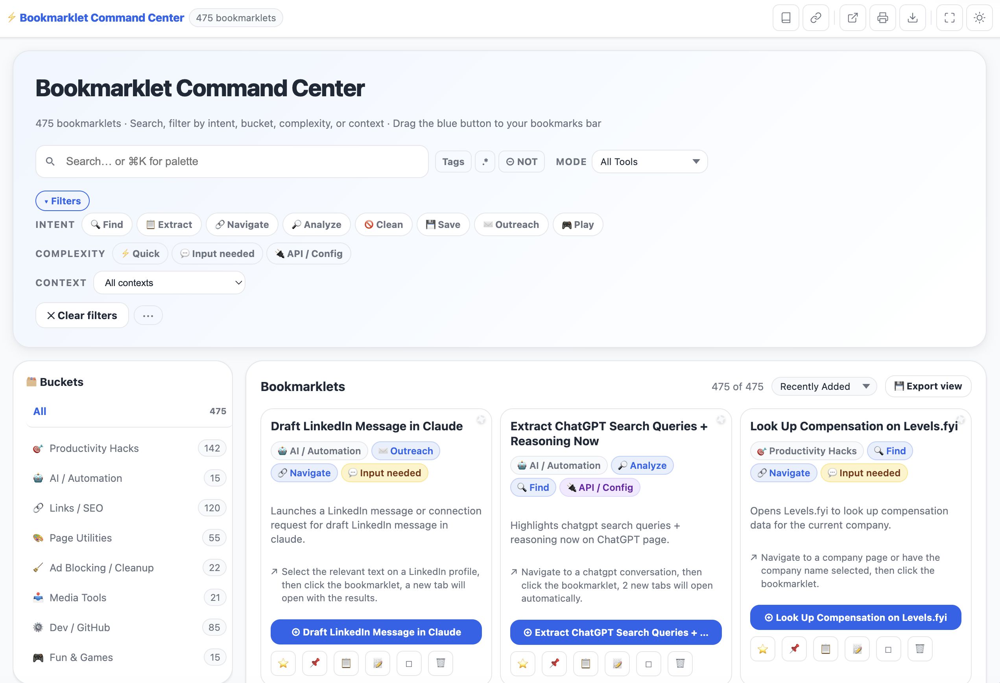

# 🔖 Bookmarklet Command Center

**475 bookmarklets. One file. Zero chaos. Fully operational.**

A fast, searchable, filterable **browser workflow command center** built for **talent sourcers, recruiters, OSINT researchers, and power users** who refuse to let their browser toolbar become a graveyard.

Organize, search, install, run, annotate, and share hundreds of bookmarklets instantly - without extensions, tab chaos, logins, or “wait, where did I put that one?”

👉 **[Open the live app](https://ohsusannamarie.github.io/bookmarklet-os)**

---

## Preview

Search, filter, and launch 475 bookmarklets by intent, bucket, complexity, or context - no browser extension required.

---

## What Is This?

The Bookmarklet Command Center is a **single-file browser app** that turns a pile of bookmarklets into an actual system.

It helps you:

* Search 475 bookmarklets instantly
* Filter by **category**, **intent**, **complexity**, and **where the tool works**
* Save favorites ⭐ and pin active tools 📌
* Track recents and most-used tools so your workflow starts surfacing itself
* Add personal notes and workflow context
* Copy bookmarklet code instantly
* Export your library to CSV
* Generate shareable micro-sites for focused collections

Think: **bookmarklet library + search engine + workflow OS**

---

## Why This Exists

Bookmarklets are genuinely powerful.

They are fast, portable, lightweight, and do not require a browser extension, server, login, or complicated setup.

The problem is not the tools.

The problem is that they end up scattered across bookmark folders, Google Docs, Slack threads, half-finished notes, random browser profiles, and that one place you swear you saved it but absolutely did not.

This turns raw browser chaos into a **structured, searchable command center**.

Organized chaos > raw chaos.

---

## How to Use It

👉 **[Open the live app](https://ohsusannamarie.github.io/bookmarklet-os)**

Or download [`index.html`](./index.html) and open it locally. It works on `file://` too.

1. Open the app
2. Search or filter to find the tool you need
3. Drag any blue bookmarklet button to your bookmarks bar
4. Click the bookmarklet from your bookmarks bar on any page to run it

No extensions.
No login.
No nonsense.

---

## Key Features

### 🔎 Instant Search + Command Palette

Search across bookmarklet names, descriptions, tags, buckets, and workflow context.

Supports:

* Fuzzy search
* Regex search
* Natural language-style search
* Keyboard-first navigation
* `/` shortcut for fast command palette access

For when your brain knows the vibe of the tool but not the name of the tool. Which is, frankly, rude of the brain.

---

### 🗂️ Buckets

Bookmarklets are organized into practical workflow buckets:

* ⚡ **Productivity Hacks** - tab management, clipboard tools, page speed, form helpers
* 🔗 **Links / SEO** - link extractors, URL tools, SERP helpers, redirect tools
* 🛠️ **Dev / GitHub** - GitHub profile tools, code helpers, dev utilities
* 🤖 **AI / Automation** - AI-powered sourcing, ChatGPT helpers, workflow automations
* 🧰 **Page Utilities** - accessibility tools, layout tweaks, reader mode, dark mode injectors
* 🚫 **Ad Blocking / Cleanup** - paywall busters, cookie banners, clutter removal
* 🎬 **Media Tools** - video controls, image tools, download helpers
* 🎮 **Fun & Games** - interactive effects, novelty scripts, delightful nonsense

---

### 🎯 Intent Filters

Filter by what you are trying to do, not just where the tool lives:

* 🔍 Find
* 📋 Extract
* 🔗 Navigate
* 🔎 Analyze
* 🚫 Clean
* 💾 Save
* ✉️ Outreach
* 🎮 Play

Because “I need the thing that pulls emails from this page” is much more human than “where did I file that JavaScript snippet?”

---

### ⭐ Favorites + 📌 Active Tools

Star what matters.

Pin what you are using right now.

Your toolbar, your rules.

---

### 🕘 Recents + Usage Tracking

The app remembers what you actually use, not just what you optimistically saved three months ago during a productivity spiral.

Recently used and most-used tools help your real workflow rise to the surface.

---

### 📝 Notes, Collections + Workflow Context

Add notes to bookmarklets.

Group tools into custom collections.

Build repeatable workflows instead of letting your browser turn into a junk drawer with Wi-Fi.

---

### 📋 Copy Code Instantly

Copy bookmarklet JavaScript or prompt text without opening new tabs or digging through source files.

Useful for:

* Tweaking tools
* Sharing snippets
* Saving backup copies
* Building custom workflows

---

### 🌙 Display Options

Includes:

* Light and dark mode
* Compact, default, and cozy density
* Icon-focused layouts
* Focus mode for stripped-down results

Built for people who actually live in browser tabs all day.

---

### 🧠 AI Persona Mode

Surface bookmarklets by workflow persona.

Pick the kind of work you are doing and get a curated tool set matched to the job instead of scrolling through 475 options like a tiny browser goblin.

---

### 💾 Export + Share

Export:

* Full library
* Favorites
* Filtered views
* Collections

Generate a shareable micro-site for any collection.

Useful for team enablement, sourcing workflows, research kits, training docs, or your own beautifully over-engineered little command center.

---

## Best For

* Talent sourcing and recruiting
* LinkedIn X-Ray and Boolean search
* GitHub sourcing and technical research
* OSINT investigations
* Competitive research and market intelligence
* Data extraction and scraping workflows
* Outreach prep and enrichment
* Browser-heavy workflows where speed matters

---

## Safety Note

Bookmarklets run JavaScript on the page you are viewing.

That is what makes them useful - and why you should know what a bookmarklet does before running it.

This project is designed around transparent, inspectable bookmarklets. You can view, copy, and review the code before installing or running anything.

Use common sense. Do not run random JavaScript on sensitive pages unless you understand what it does.

Tiny tools. Big power. Respect the goblin magic.

---

## Tech Stack

* HTML
* Vanilla JavaScript
* localStorage

That is it.

No frameworks.
No build step.
No server.
No dependencies.
No “please install 47 packages before this works.”

Just open the file and go.

---

## Project Philosophy

This project exists because useful tools should be:

* Fast
* Portable
* Searchable
* Inspectable
* Easy to modify
* Easy to share
* Frictionless enough that people actually use them

If the information only lives in your head, your bookmarks bar, or one chaotic notes app, it does not exist yet.

This makes it exist.

---

## Keywords

bookmarklet manager, bookmarklet command center, bookmarklet library, sourcing tools, recruiter tools, talent sourcing, LinkedIn sourcing, GitHub sourcing, X-Ray search, Boolean search, OSINT tools, browser automation, productivity tools, JavaScript bookmarklets, research tools, data extraction, talent intelligence, recruiting automation, browser workflow tools

---

## If This Helps You

Star the repo.
Fork it.
Make it your own.

Or just quietly become 10x faster.

That works too.
